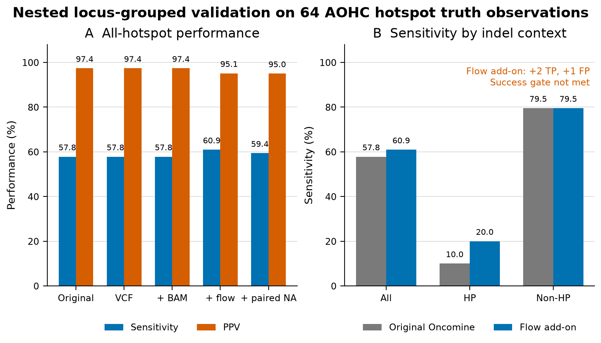
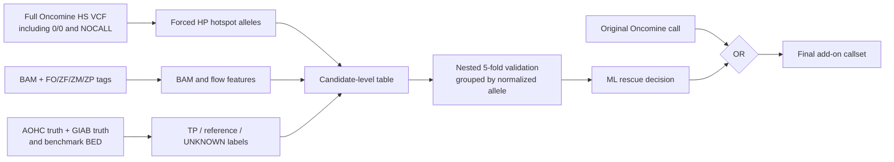

# Ion Torrent homopolymer-indel rescue

Research pipeline for testing whether an XGBoost add-on can recover
homopolymer (HP) indels missed by the Ion Torrent/Genexus Oncomine caller while
preserving every original Oncomine call.

> **Proof-of-concept result:** adding BAM and Ion ZM/ZP flow features increased
> AOHC all-hotspot sensitivity from **57.81% to 60.94%**, while PPV changed from
> **97.37% to 95.12%**. The gain was two run-level observations from one PTEN
> locus and cost one additional false positive, so the predefined success gate
> was **not met**.



## Main findings

Nested, locus-grouped validation used 16 AOHC hotspot truth indels across four
runs (64 truth observations). The ML model was allowed to add an HP call but
never remove an original call.

| System | TP | FP | FN | Sensitivity | PPV | Rescued FNs |
|---|---:|---:|---:|---:|---:|---:|
| Original Oncomine | 37 | 1 | 27 | 57.81% | 97.37% | 0 |
| VCF + context | 37 | 1 | 27 | 57.81% | 97.37% | 0 |
| VCF + BAM | 37 | 1 | 27 | 57.81% | 97.37% | 0 |
| **VCF + BAM + flow** | **39** | **2** | **25** | **60.94%** | **95.12%** | **2** |
| Flow + paired NA24385 baseline | 38 | 2 | 26 | 59.38% | 95.00% | 1 |

Additional observations:

- HP sensitivity increased from **10% (2/20)** to **20% (4/20)** with the
  flow-inclusive add-on.
- Non-HP performance was deliberately unchanged: **79.55% sensitivity** and
  **97.22% PPV**.
- Both rescued observations were the same PTEN A6-to-A5 deletion
  (`10:89717769 TA>T`) in AOHC2 and AOHC4.
- The added false positive was an A8-to-A7 deletion
  (`14:45645954 CA>C`) in AOHC4.
- The predefined target—at least 8 of 18 HP false negatives rescued with no
  more than 1 added AOHC false positive—was not achieved.

Full small result tables are tracked in
[`docs/results`](docs/results); the detailed interpretation is in
[`docs/EXPERIMENT_SUMMARY.md`](docs/EXPERIMENT_SUMMARY.md).

## Experimental design



The forced-hotspot design is important. It measures every normalized Oncomine
hotspot HP allele, including reference and NOCALL records; it does not require
the allele to pass a CIGAR-support or allele-fraction discovery threshold.

### Dataset snapshot

| Item | Count |
|---|---:|
| Runs | 8: four AOHC + four NA24385 |
| Unique forced HP hotspot alleles | 77 |
| Candidate observations | 616 |
| Labeled observations used for modeling | 592 |
| Positive observations | 20: five loci × four AOHC runs |
| Confident-reference observations | 572 |
| UNKNOWN observations excluded | 24 |
| Rows with usable ZM flow measurements | 616/616 |

## Features

- **VCF:** TYPE, LEN, AF, AO, FAO, FDP, FRO, strand counts, HRUN, MLLD,
  RBI, bias metrics, QUAL, FILTER, GT, raw/flow AF difference, and parsed TVC
  filter reasons.
- **Sequence context:** HP base, reference/alternate run lengths, HP delta,
  indel type/length, local GC, and sequence entropy.
- **BAM:** forced allele support, coverage, strand support, MAPQ, soft clipping,
  read position, distance to read ends, mismatch burden, and local indel burden.
- **Ion flow space:** candidate-flow ZM signal, reference/alternate residuals,
  ALT-closer fraction, neighboring-flow noise, ±5-flow signals, and CF/IE/DR.

Genomic position, gene, sample ID, and run ID are metadata only. They are not
predictive features. Reverse-strand reads are reconstructed in physical
sequencing/flow orientation before flow matching.

## Validation safeguards

- Five outer folds are grouped by normalized genomic allele. All AOHC and
  NA24385 observations of the same allele remain together.
- Each outer fold holds out one of the five positive HP loci.
- Rescue thresholds are selected only from inner locus-grouped out-of-fold
  predictions, never from the outer test fold.
- `UNKNOWN` rows are excluded from fitting.
- The final rule is
  `original Oncomine positive OR ML rescue`; original calls cannot be lost.
- The full test suite currently contains 23 passing tests, including forward
  and reverse flow reconstruction, truth labeling, and locus-leakage checks.

Accuracy and specificity are not reported because there is no well-defined
finite universe of true-negative genomic positions. The primary metrics are
sensitivity and PPV over the defined hotspot callset.

## Installation

Requirements include Python 3.11, bcftools, samtools, pysam, pandas,
scikit-learn, XGBoost, pyarrow, and matplotlib.

```bash
conda env create -p .conda-env -f environment.yml
conda activate ./.conda-env
python -m pip install -e .
pytest
```

The GitHub Actions workflow runs the unit tests on Python 3.11.

## Required inputs

Sequencing and reference files are intentionally excluded from the repository.

| Input | Purpose |
|---|---|
| Full/unfiltered Oncomine VCF | Hotspot alleles and caller evidence |
| BAM + BAI | Alignment and Ion flow tags |
| AOHC synthetic truth VCF | Synthetic AOHC positives |
| HG002 GIAB truth VCF + index | Native HG002 positives |
| GIAB benchmark BED | Defines confident reference labels |
| GX7 target BED | Panel interval restriction |
| hg19/GRCh37 FASTA + FAI | Normalization and sequence context |

Copy [`config/samples.example.tsv`](config/samples.example.tsv) and update the
paths for the local data. `truth_profile=AOHC` uses AOHC synthetic plus GIAB
truth; `truth_profile=HG002` uses GIAB truth only.

## Run the forced-hotspot experiment

Build and validate the feature dataset:

```bash
python scripts/build_hotspot_rescue_dataset.py \
  --manifest config/samples.example.tsv \
  --aohc-truth data/AOHC_truth.vcf \
  --giab-truth data/HG002_GRCh37_benchmark.vcf.gz \
  --giab-bed data/HG002_benchmark.bed \
  --target-bed data/GX7_targets.bed \
  --fasta data/hg19.fasta \
  --output-dir output/hotspot_rescue \
  --bcftools bcftools \
  --max-reads-per-candidate 50
```

Training refuses to run without a passing extraction marker. After validation:

```bash
python scripts/train_hotspot_rescue_xgboost.py \
  --candidates output/hotspot_rescue/hotspot_hp_features.parquet \
  --truth-observations output/hotspot_rescue/aohc_hotspot_truth_observations.parquet \
  --output-dir output/hotspot_rescue/models \
  --folds 5 \
  --inner-folds 4 \
  --inner-fp-budget 0
```

Recreate the README figure from the tracked summary table:

```bash
python scripts/make_readme_figures.py
```

## Repository layout

```text
ion_hp_ml/                 Python feature extraction and training modules
scripts/                   Command-line entry points and figure generation
tests/                     Unit tests
config/                    Example sample manifest
docs/results/              Small, shareable result summaries
docs/figures/              Reproducible README figures
.github/workflows/         Continuous-integration tests
```

Large inputs, candidate tables, caches, and fitted model binaries are ignored
by Git. The original blind CIGAR-candidate workflow remains available through
`scripts/build_rescue_dataset.py` and `scripts/train_rescue_xgboost.py`.

## Limitations

- Only five unique positive HP hotspot loci were available for model
  development.
- The two rescued observations represent one unique locus, not two independent
  biological loci.
- AOHC and NA24385 runs are technical/sample replicates rather than a
  prospective clinical cohort.
- The paired-NA feature set assumes a matched control baseline is available.
- This is research software and is **not validated for clinical diagnosis**.

The next useful experiment is to add independent positive HP loci through a
dilution series or orthogonal control, then repeat the same locked,
locus-grouped evaluation without retuning on these five loci.

## Data, license, and reuse

No BAM, VCF, reference genome, panel BED, spreadsheet, or model binary is
included in the GitHub package. Users must obtain appropriately authorized
inputs and verify their redistribution terms. A software license has not been
selected; add a `LICENSE` file before advertising the repository as open
source.
